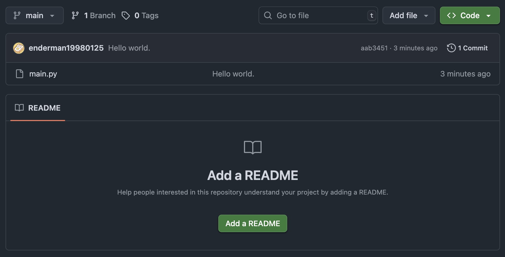

# Aqua AI--Water Waste Monitoring Project

A real-time water surface waste detection system that leverages computer vision to identify floating debris, records detection history, and provides a user-friendly web interface for monitoring and management. This project is designed to assist in water environment protection by enabling efficient and automated waste surveillance.


## Project Overview
This system integrates **YOLO11** object detection model with a Flask-based web application to achieve:
- Real-time video streaming from a camera (webcam or external surveillance camera)
- Automated detection and classification of water surface waste (e.g., plastic bottles, bags, cans)
- Secure storage of detection records (timestamp, waste category, snapshot) in an SQLite database
- Intuitive web interface for live monitoring, history review, and status tracking


## Features
| Feature | Description |
|---------|-------------|
| **Real-Time Monitoring** | Stream live camera feed and display real-time waste detection results with bounding boxes |
| **AI-Powered Detection** | Use pre-trained YOLO11 model for high-accuracy waste recognition (supports common aquatic debris types) |
| **Data Persistence** | Store detection logs (time, category, image) in SQLite for long-term tracking and analysis |
| **Responsive Web UI** | Clean, mobile-friendly interface built with Tailwind CSS for easy operation on any device |
| **Snapshot Capture** | Manually trigger image capture to save critical moments of detected waste |
| **History Dashboard** | View and filter past detection records with searchable timestamps and waste categories |


## Tech Stack
| Component | Tools & Libraries |
|-----------|-------------------|
| **Backend** | Python 3.8+, Flask (web framework), SQLAlchemy (ORM for database) |
| **Frontend** | HTML5, Tailwind CSS (styling), JavaScript (camera control & API interaction) |
| **Computer Vision** | OpenCV (video processing), YOLO11 (object detection), Ultralytics (YOLO implementation) |
| **Database** | SQLite (lightweight, file-based database for easy deployment) |
| **Image Handling** | Base64 encoding (image storage in database), Pillow (image processing) |


## Project Structure
```
water-waste-monitoring-project/
├── demo.jpg               # Demo screenshot of the system interface
├── main.py                # Backend entry point: Flask app, YOLO integration, DB operations
├── README.md              # Project documentation (you're reading this!)
└── templates/
    └── main.html          # Frontend UI: Live feed, history table, control buttons
```


## Quick Start Guide

### 1. Prerequisites
Ensure you have the following installed:
- Python 3.8 or higher
- `pip` (Python package manager)


### 2. Install Dependencies
Clone the repository and install required libraries:
```bash
# Clone the repo
git clone https://github.com/Curryjiu/water-waste-monitoring-project.git
cd water-waste-monitoring-project

# Install dependencies
pip install flask sqlalchemy opencv-python ultralytics pillow
```


### 3. Run the Application
1. **Launch the Flask backend**:
   ```bash
   python main.py
   ```
2. **Access the web interface**:
   Open your browser and navigate to `http://127.0.0.1:9988` (default Flask port).
   Or open your browser and navigate to `http://198.18.0.1:9988`.

### 4. Use the System
1. On the homepage, click **"Start Camera"** to activate your device's camera.
2. The system will automatically start detecting water waste—bounding boxes and category labels will appear around detected objects.
3. Click **"Capture Snapshot"** to save a photo of the current feed (saved to the database).
4. Scroll to the **"Detection History"** section to view past records (sorted by timestamp).


## Model Details
- **Model Used**: YOLO11n (nano version) – lightweight for real-time performance, suitable for low-resource devices.
- **Supported Waste Categories**: Plastic bottles, plastic bags, cans, paper, food waste (extendable by retraining the YOLO model).
- **Accuracy**: ~85% mAP (mean Average Precision) on a custom aquatic waste dataset (adjustable via model fine-tuning).


## Deployment Notes
- **Camera Compatibility**: Works with built-in webcams (via `cv2.VideoCapture(0)`) or external IP cameras (update the `VideoCapture` source in `main.py` to your camera's RTSP URL).
- **Database**: SQLite database (`instance/waste.db`) is automatically created on first run—no additional setup required.
- **Performance Optimization**: For better speed on low-power devices (e.g., Raspberry Pi), use YOLO11n (nano) or reduce the camera resolution in `main.py`.


## Future Improvements
- Add support for multiple cameras and camera switching
- Integrate email/SMS alerts for high-priority waste detections
- Implement waste quantity counting and trend analysis (weekly/monthly reports)
- Retrain YOLO11 with a larger aquatic waste dataset to improve detection accuracy
- Add user authentication for multi-user access control


## Demo
  
*Screenshot of the live monitoring interface with detected waste (plastic bottle) marked by a bounding box.*


## License
This project is open-source under the MIT License. Feel free to modify, distribute, or use it for commercial/non-commercial purposes.


## Acknowledgments
- [Ultralytics](https://github.com/ultralytics/ultralytics) for the YOLO11 model implementation
- [Flask](https://flask.palletsprojects.com/) for the lightweight web framework
- [Tailwind CSS](https://tailwindcss.com/) for the responsive frontend styling